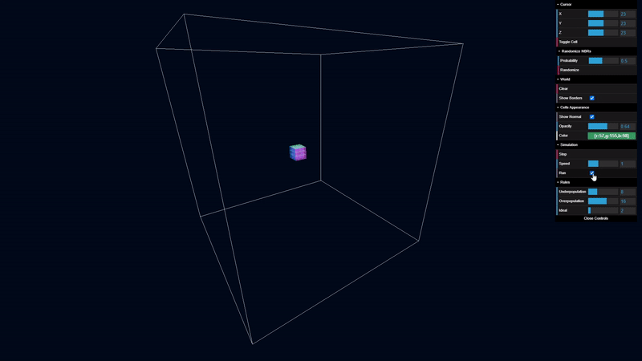

# Conway's Game of Life 3D

A 3D implementation of Conway's Game of Life written in JavaScript using [Three.js](https://threejs.org/) and [dat-gui](https://github.com/dataarts/dat.gui). 

**It's configurable with a real-time response! (Yes, you can change rules while the simulation is running)** 

Give it a try 🚀 https://marianpekar.github.io/game-of-life-threejs/

## GUI Manual

In the top-right corner is a beautiful dat-gui (some people say it's ugly, I disagree with that) with contains these folders: **Cursor, World, Cells Appearance** (folded)**, Simulation**, and **Rules**. Let's take a closer look at  them.

### Cursor
Here you can set XYZ position of the cursor (red half-transparent cube initially in the middle of the world) and toggle selected cell between dead and alive state.

You can also use the **Randomize NBRs** feature, to randomly switch states of 26 cells that surround the cursor with **Probability** you can set above the **Randomize** button.

### World
This one is super simple. Her you can either **Clear** the world (kill all cells) or toggle show of world border lines.

### Cells Appearance
It's initially folded. When you unfold it, you can switch cells material between Normal and Phong material (**Show Normal** checkbox), set it's **Opacity** and **Color** (the color is, of course, see only when Show Normal is off). 

### Simulation
Here comes the fun part! This allows you to **Run** the simulation with the given **Speed** (1 = one step per second) or you can step manually with the **Step** button.

### Rules
And last but not least, the rules! But don't worry, these rules are not here to bother you, in fact, you can have a lot of fun with them!

- Any live cell with a count of neighbors <= **Underpopulation** dies.
- Any live cell with a count of neighbors >= **Overpopulation** dies.
- Any dead cell with a count of neighbors == **Ideal** becomes a live cell.

If this sounds cryptic for you, check out the links below, the whole thing is actually very simple, yet so beautiful!

## Learn about Conway's Game of Life

- [What if the Universe is a Computer Simulation? - Computerphile](https://www.youtube.com/watch?v=YOxDb_BbXzU)
- [Conway's Game of Life - Wikipedia](https://en.wikipedia.org/wiki/Conway%27s_Game_of_Life)

## Keyboard & Mouse Controlls

You can use a *mouse to move around* and *keyboard to perform some actions* too.

### Mouse

- **LMB + Move** –⁠ rotate view
- **MMB + Move** or **Scroll** –⁠ zoom in/out  
- **RMB + Move** –⁠ move on a horizontal plane

### Keyboard

- **Enter** – next step
- **W, S, A, D** – move cursor forward, backward, left, and right respectively
- **Q, E** – move cursor up and down respectively
- **R** – move cursor to the center of the world
- **Space** – toggle cell state at the position of cursor
- **Delete** – clear the world
- **V** – toggle cursor visibility
